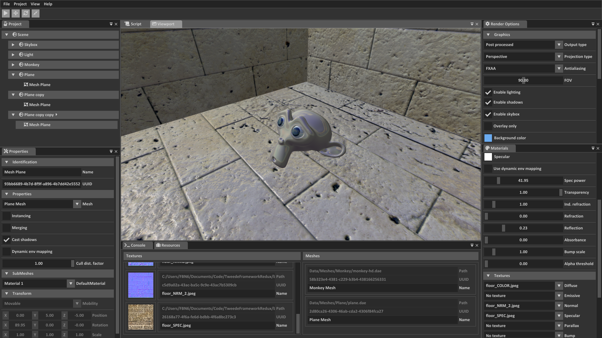
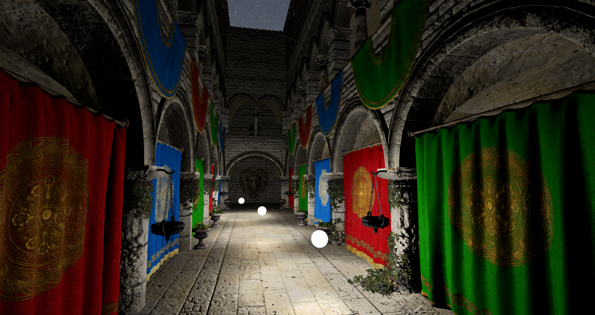
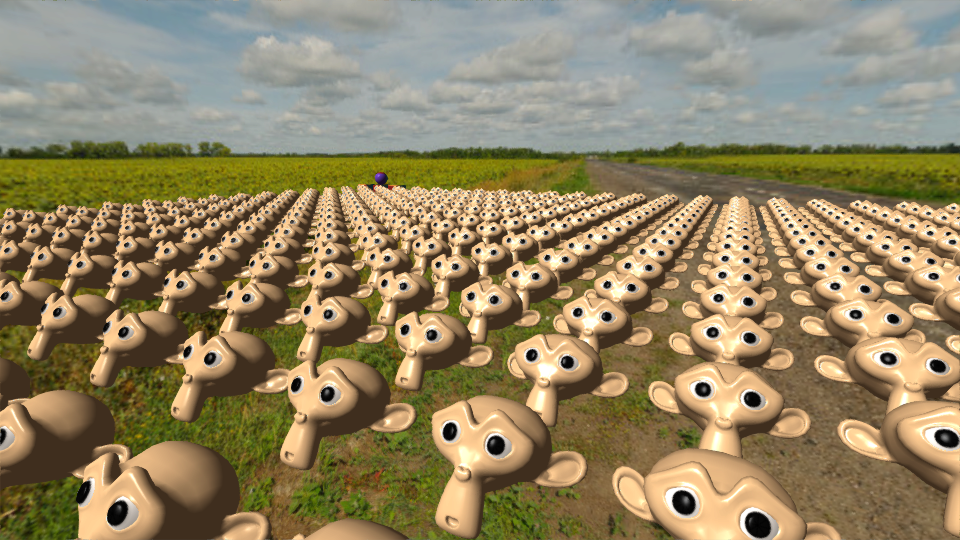

| CI            |
| ------------- |
  

# TweedeEngine Framework

The Tweede Engine Framework Redux is my third attempt to develop a cross-platform full game engine and game framework. It aims to provide one day a complete foundation for the development of real time graphical applications such as games

## Get started
* [Compiling](Documentation/Compiling.md) - Learn how to compile the framework from the source code. 
* [Dependencies](Documentation/Dependencies.md) - Check if you have every dependency needed by the engine
* [Shaders](Documentation/Shaders.md) - Shader files format

## Features

* In progress

## Previews

